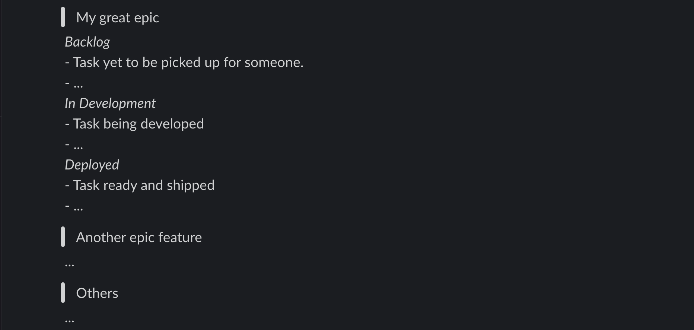

This project intent is to create a short report of your current sprint on Jira board.
That's done using atalassian api and your personal api token.

## The report

The output format is optimized for slack mesasges as follows:
(Press cmd+shift+f after pasting it on slack chat)

```
> [Epic summary]
 _[State summary]_
 - [Task summary]
 - ...

> Others (Missing epic tasks)
 _[State summary]_
 - [Task summary]
 - ...

```

Example:
```
> My great epic
 _Backlog_
 - Task yet to be picked up for someone.
 - ...
 _In Development_
 - Task being developed
 - ...
 _Deployed_
 - Task ready and shipped
 - ...

> Another epic feature
 ...

> Others
 ...
```

And te resulting report in slack:


## Usage

Access this project folder after cloning it.
then run the following command replacing your board_id and your personal auth token.

```sh
ruby report.rb [board_id] [auth_token]
```

*Recomended*: In case you don't want your credentials in your shell history, you can add an alias for using it.

```sh
alias sprint_report='ruby ./report.rb [board_id] [auth_token]'
```
