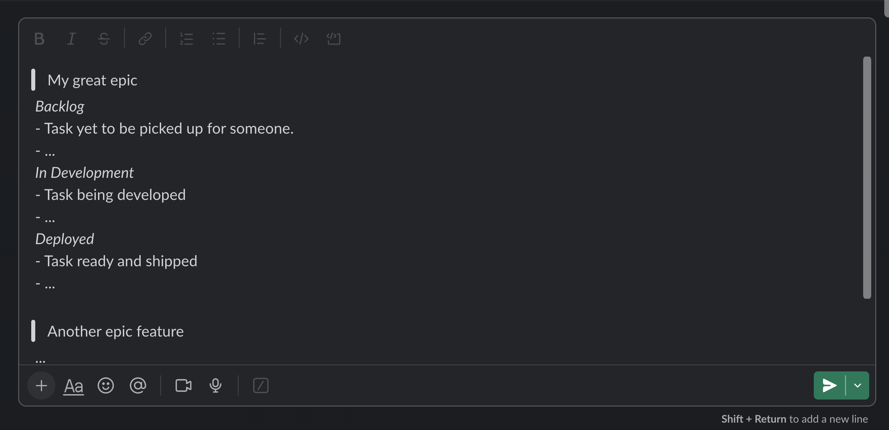

This project intent is to create a short report of your current sprint on Jira board.
That's done using atalassian api and your personal api token.

## The report

The output format is optimized for slack mesasges as follows:


This is the raw format output:

```
> [Epic summary]
 _[State summary]_
 - [Task summary]
 - ...

> Others (Missing epic tasks)
 _[State summary]_
 - [Task summary]
 - ...

```
(Press cmd+shift+f after pasting it on slack chat)

This was the output used for the example image:
```
> My great epic
 _Backlog_
 - Task yet to be picked up for someone.
 - ...
 _In Development_
 - Task being developed
 - ...
 _Deployed_
 - Task ready and shipped
 - ...

> Another epic feature
 ...

> Others
 ...
```

## Usage

Access this project folder after cloning it.
Then run the following command replacing your board_id and your personal auth token.

```sh
ruby report.rb [board_id] [auth_token]
```

[Here is a good and short article](https://medium.com/@prateek.bvbcet/how-to-access-jira-cloud-api-39c1bfc774ed) that goes through all the steps required for generating your **auth token**.

*Recomended*: In case you don't want your credentials in your shell history you can add it in an alias as follows:

```sh
alias sprint_report='ruby ./report.rb [board_id] [auth_token]'
```

The report will be generated once you run it and copied to your transfer area.
This will be outputed to your console:
```
Identifying current sprint...
Active sprint: YOUR SPRINT NAME X
Requesting current sprint issues...
Report copied to your transfer area. Press ctrl+v/cmd+v to paste the results
```

Then you just need to past it on slack and presh cmd+shift+f for using makdown interpreter and there you go.

Enjoy it!
